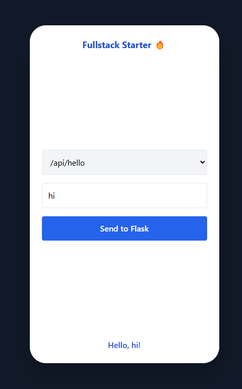

---

# ⚡️ Fullstack Starter — Flask + React + Tailwind (Codespaces-Ready)

> A zero-setup, mobile-friendly, fullstack development platform  
> for building API-driven apps quickly, cleanly, and anywhere.

---

## 🧠 The Problem

Every time you want to test a new app idea, you lose hours to:

- Setting up environments
- Installing Python, Node, React, Tailwind, PostCSS, etc.
- Dealing with local port conflicts
- Debugging toolchain issues
- Switching contexts between frontend and backend

It slows you down, kills flow, and distracts you from what matters: **building the idea**.

---

## 💡 The Solution

This starter gives you a **fully working fullstack template**:
- 🚀 **Flask backend** with example APIs
- ⚛️ **React frontend** using JSX
- 🎨 **Tailwind CSS styling**
- 🔁 API already wired together
- 📱 **Mobile-style UI**
- 🌐 **Runs in GitHub Codespaces** — no installs, no pollution of your machine

You get a platform where:

✅ Frontend and backend work out of the box  
✅ All configs are ready (CORS, Tailwind, ESBuild, etc.)  
✅ You can test ideas **faster than ever**  
✅ You don’t touch your local setup — no virtualenvs or npm installs locally  
✅ You can open a Codespace and **get building in 60 seconds**

---

## 🛠️ Setup Instructions

### ✅ 1. Clone the Repository

```bash
gh repo create your-new-app --template your-username/fullstack-starter
```

Or just click `Use this template` on GitHub.

Then open the repo in **GitHub Codespaces**.

---

### ✅ 2. Start the Backend

```bash
cd backend
source venv/bin/activate
python app.py
```

- Flask runs on port `5000`
- Make the port **public**
- Test with:
```bash
curl -X POST https://<your-subdomain>-5000.app.github.dev/api/hello \
  -H "Content-Type: application/json" \
  -d '{"name":"You"}'
```

---

### 🧠 3. Update the API Link in the Frontend

Because Codespaces assigns a **dynamic URL**, you need to update your frontend code to match the backend URL:

- Open: `frontend/src/main.jsx`
- Find this line:

```js
const url = `https://YOUR-CODESPACE-5000.app.github.dev/api/${endpoint}`;
```

- Replace it with your real backend URL, e.g.:

```js
const url = `https://literate-fishstick-7r94xw99rv9cxwvq-5000.app.github.dev/api/${endpoint}`;
```

✅ Save the file  
✅ Then rebuild your frontend (`node build.js`)

---

### ✅ 4. Start Tailwind Watcher

```bash
cd frontend
npx tailwindcss -i ./src/index.css -o ./dist/output.css --watch
```

Keeps styles live as you code.

---

### ✅ 5. Build & Serve Frontend

```bash
cd frontend
node build.js
npx serve .
```

- Make the frontend port public (3000 or 4173)
- Open the link — you’ll see a mobile-style UI with working API integration

<p align="center">
  
</p>
<p align="center"><em>📱 Mobile-styled UI after setup is complete</em></p>

---

## 📦 Project Structure

```
fullstack-starter/
├── backend/          # Flask app
│   ├── app.py
│   └── requirements.txt
├── frontend/         # React + Tailwind
│   ├── src/
│   ├── dist/
│   ├── index.html
│   ├── main.jsx
│   ├── build.js
│   └── package.json
├── README.md
└── kickoff-template.md  # For starting new ideas
```

---

## 🎯 What It’s Great For

- ✅ Trying new app ideas quickly
- ✅ Avoiding tech setup overhead
- ✅ Keeping frontend + backend synced
- ✅ Building in the cloud with no local noise
- ✅ Working **with ChatGPT** or team members easily

---

## 🧠 What’s Built-In

| API Route         | Method | What it Does                         |
|-------------------|--------|--------------------------------------|
| `/api/hello`      | POST   | `{ name }` → `"Hello, name!"`       |
| `/api/repeat`     | POST   | `{ word }` → `"wordword"`           |

---

## 🧬 Built for Reuse and Iteration

This project isn’t just a demo — it’s your **base to launch every future idea from**.

Open [`kickoff-template.md`](./kickoff-template.md) for how to brief ChatGPT or collaborators to start building your next app in seconds.

---

## 🌱 Ready to Build?

Just say:  
> “I'm using `fullstack-starter`. Here's my idea…”

And you're off. ✨

---

### ✅ Pushing Your Changes to GitHub

Once you're happy with your changes, commit and push them to GitHub:

```bash
git add .
git commit -m "Your commit message"
git push
```

> 📝 Make sure you're on the correct branch (`main` or another)  
> 🔄 If it's a fork or new project, confirm your remote:
```bash
git remote -v
```

This keeps your base updated and ready for reuse across projects. 🚀

---

Absolutely! Here's a polished **FAQ section** you can drop directly into your `README.md` to address all the real-world issues that came up:

---

## ❓ FAQ – Common Issues & How to Fix Them

Here are a few helpful tips based on feedback from developers using this starter in Codespaces and beyond:

---

### 🧩 Q: Why does `npm run dev` give me an error?

> **A:** This starter doesn’t use Vite by default, so `npm run dev` will fail unless you manually add the script.

If you want to enable it:

```json
// Add to frontend/package.json
"scripts": {
  "dev": "vite",
  "build": "node build.js"
}
```

By default, this starter uses:

```bash
npx tailwindcss -i ./src/index.css -o ./dist/output.css --watch
node build.js
npx serve .
```

---

### ⚙️ Q: I'm getting a PostCSS config error when using `"type": "module"`

> **A:** If your `package.json` uses `"type": "module"`, PostCSS expects an ES module format too.

✅ Either rename the file:

```bash
postcss.config.js ➜ postcss.config.cjs
```

**OR** use ESM syntax inside the file:

```js
// postcss.config.js
export default {
  plugins: {
    tailwindcss: {},
    autoprefixer: {},
  },
}
```

---

### 🌀 Q: I updated the components but still see "Fullstack Starter 🔥" on screen?

> **A:** This happens if you didn’t clear the sample content in `index.html` or Starter.jsx.

✅ Make sure to:
- Remove or comment out any `<h1>Fullstack Starter 🔥</h1>` blocks
- Replace the JSX in `main.jsx` or `App.jsx` with your new components

This keeps the screen clean for your app layout.

---

### 🌍 Q: Why do my fetch requests fail in Codespaces?

> **A:** If you’re using `"proxy": "http://localhost:5000"` in `package.json`, it will break in Codespaces or production.

✅ Best practice: use full URLs to your **public backend port**:

```js
const url = "https://your-codespace-5000.app.github.dev/api/..."
```

> 🔒 Make sure port 5000 is set to **Public** in the Codespaces ports tab.

---

